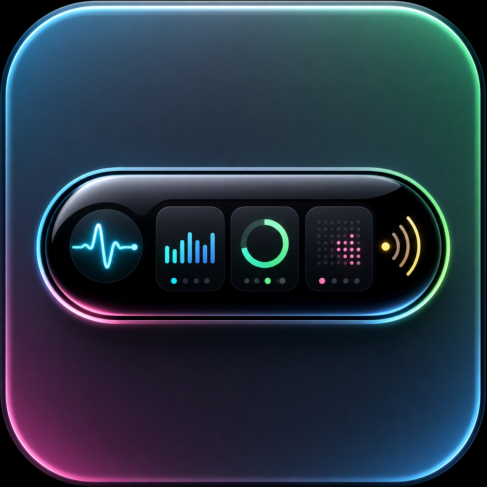

# Dynamic Island for Windows

Windows 桌面灵动岛原型，基于 Electron + Vite 构建。它在桌面顶部显示透明、置顶的动态岛，用于媒体播放、隐私状态、剪贴板操作和系统监控。

<p>
  
</p>

## 中文

### 下载

Windows x64 版本。

推荐下载：

- [Windows 动态岛安装 0.1.6.exe](https://github.com/Yurdos-r/dynamic-island-for-windows/releases/download/v0.1.6/Dynamic.Island.for.Windows.Setup.0.1.6.exe)：安装程序，带开始菜单、桌面快捷方式和卸载支持。

便携替代方案：

- [Dynamic.Island.for.Windows.0.1.6.exe](https://github.com/Yurdos-r/dynamic-island-for-windows/releases/download/v0.1.6/Dynamic.Island.for.Windows.0.1.6.exe)：双击即可启动的便携构建。

备注：

- 当前构建未签名，Windows 或安全软件可能在首次启动时提示警告。
- 暂无自动更新和代码签名。
- 运行时日志写入 `%APPDATA%\Dynamic Island for Windows\island-startup.log`。

### 功能

- 透明无边框桌面动态岛，支持胶囊、小岛和卡片状态。
- 默认顶部居中显示，也保留经典布局选项。
- 媒体界面支持专辑封面、歌曲信息、播放控制、进度跳转、喜欢状态和同步歌词。
- 隐私胶囊显示麦克风、摄像头和位置状态，并能合并展示多个同时使用的权限。
- 剪贴板提示和剪贴板历史界面；已确认加入的历史会持久化，重启后恢复，删除和清空会同步保存。
- 系统监控胶囊显示 CPU、内存、GPU、磁盘和运行时间。
- 设置中可调整玻璃样式、布局、系统监控显示、键盘锁定提示和 Windows 开机自启动。
- 托盘菜单支持显示动态岛、切换状态和退出应用。
- Windows x64 安装包和便携 `.exe` 内置渲染资源、PowerShell 原生辅助脚本和本地桥接安全 token。

### 从源码运行

```bash
npm install
npm run dev
```

`npm run dev` 会启动 Vite `http://127.0.0.1:5173`，并用软件渲染模式打开 Electron。

本地生产模式运行：

```bash
npm start
```

### 构建 Windows 包

```bash
npm run dist:win
```

生成的安装包和便携版位于 `release/`，用于 GitHub Releases，不建议提交到仓库。

开发环境用户数据位于：

```text
.tmp/dynamic-island-user-data/
```

打包运行时用户数据位于 Electron 默认 userData 目录，主要文件包括：

```text
%APPDATA%\Dynamic Island for Windows\island-startup.log
%APPDATA%\Dynamic Island for Windows\clipboard-history.json
```

### 隐私与本地桥

Dynamic Island for Windows 在本地运行。应用读取本机 Windows 媒体/会话状态、隐私指示器、剪贴板数据和系统指标，仅用于渲染桌面动态岛。已确认的剪贴板历史只保存在本机应用 `userData` 目录，可在剪贴板界面删除或清空。项目没有内置远程分析或遥测服务。

BetterNCM 桥接服务只监听 `127.0.0.1:32147`，并从 0.5.0 起要求所有 HTTP 请求携带 `X-Dynamic-Island-Bridge-Token`。token 由 Dynamic Island for Windows 在本地生成并写入文件桥目录，旧版插件不会继续被信任。

文件桥使用 v2 payload，必须包含 `bridgeToken` 字段。主文件桥目录默认位于应用 userData 下的 `dynamic-island-bridge`；也会尝试兼容读取 `C:\betterncm\dynamic-island-bridge`。如需指定共享目录，可设置：

```text
DYNAMIC_ISLAND_BRIDGE_DIR=C:\path\to\dynamic-island-bridge
```

### 网易云音乐 + InfLink-rs

网易云音乐可以通过 Windows 媒体会话暴露歌曲信息，但很多版本不会提供可跳转的播放进度。若要获得更准确的元数据、进度、收藏状态、歌词和控制能力，请配合 `integrations/betterncm-dynamic-island-bridge` 中的 BetterNCM 插件和 InfLink-rs 使用。

安装方式：

1. 在网易云音乐中安装并启用 BetterNCM 和 InfLink-rs。
2. 将 `integrations/betterncm-dynamic-island-bridge` 复制到 BetterNCM 插件目录。
3. 重启网易云音乐。
4. 启动 Dynamic Island for Windows。

桥接插件读取 token 文件后，将当前歌曲、进度、喜欢状态和歌词发送给动态岛，并把播放/暂停、上一首、下一首、跳转和喜欢命令转发回网易云音乐/InfLink-rs。

### 仓库维护

仓库不提交本地依赖、构建产物、运行数据、日志、本地备份和二进制运行依赖：

- `node_modules/`
- `dist/`
- `release/`
- `.tmp/`
- `.omc/`
- `*.log`
- `betterncm.dll`
- `modularization-backups/`

### 路线图

- 原生电池和电源状态提供器。
- 音量提供器和输出设备控制。
- 专注计时器和快捷操作。
- 通知捕获或应用事件适配器。
- 多显示器定位和可配置屏幕边缘位置。
- 代码签名和更新流程。

## English

### Download

Windows x64 release.

Recommended download:

- [Dynamic Island for Windows Setup 0.1.6.exe](https://github.com/Yurdos-r/dynamic-island-for-windows/releases/download/v0.1.6/Dynamic.Island.for.Windows.Setup.0.1.6.exe): installer with Start Menu/Desktop shortcuts and uninstall support.

Portable alternative:

- [Dynamic.Island.for.Windows.0.1.6.exe](https://github.com/Yurdos-r/dynamic-island-for-windows/releases/download/v0.1.6/Dynamic.Island.for.Windows.0.1.6.exe): portable build that can be launched by double-clicking.

### Features

- Transparent frameless desktop island with capsule, island, and card states.
- Default top-center layout with an optional classic layout.
- Media surface with album art, metadata, playback controls, progress seeking, favorite state, and synced lyrics.
- Privacy capsule for microphone, camera, and location activity, including simultaneous permission summaries.
- Clipboard prompt and clipboard history surface; confirmed history is restored after restart, while deleted and cleared entries stay removed.
- System monitor capsule for CPU, memory, GPU, disk, and uptime data.
- Settings for glass style, layout, system monitor visibility, keyboard lock hints, and Windows login auto-start.
- Tray menu for showing the island, switching states, and quitting the app.
- Windows x64 installer and portable `.exe` builds with bundled renderer assets and native PowerShell helpers.

### Run From Source

```bash
npm install
npm run dev
```

For a local production-style run without the Vite dev server:

```bash
npm start
```

### Build Windows Packages

```bash
npm run dist:win
```

Generated packages are written to `release/` and are intended for GitHub Releases, not for committing to the repository.

Development user data:

```text
.tmp/dynamic-island-user-data/
```

Packaged app user data includes:

```text
%APPDATA%\Dynamic Island for Windows\island-startup.log
%APPDATA%\Dynamic Island for Windows\clipboard-history.json
```

### Privacy

Dynamic Island for Windows runs locally. It reads local Windows media/session state, privacy indicators, clipboard data, and system metrics only to render the desktop island. Confirmed clipboard history is stored locally in the app `userData` directory and can be deleted or cleared from the clipboard surface. It does not include remote analytics or telemetry.

The BetterNCM bridge listens only on `127.0.0.1:32147`. Bridge HTTP requests must include `X-Dynamic-Island-Bridge-Token`, and file bridge v2 payloads must include `bridgeToken`. Set `DYNAMIC_ISLAND_BRIDGE_DIR` to override the shared bridge directory.

### NetEase Cloud Music + InfLink-rs

Use the BetterNCM bridge in `integrations/betterncm-dynamic-island-bridge` alongside InfLink-rs for precise metadata, progress, controls, favorite state, and lyrics.

Install:

1. Install and enable BetterNCM and InfLink-rs in NetEase Cloud Music.
2. Copy `integrations/betterncm-dynamic-island-bridge` into the BetterNCM plugins directory.
3. Restart NetEase Cloud Music.
4. Start Dynamic Island for Windows.

## License

MIT
